# 海上风电巡检风险评估系统 - 架构分析

## 1. 总体架构

### 1.1 架构概述

系统采用**基于MCP协议的多Agent协作架构**，通过Model Context Protocol实现AI Agent与多个外部服务的标准化集成。

**ASCII架构图**:
```
┌─────────────────────────────────────────────────────────────────┐
│                        用户交互层                                 │
│  ┌──────────────────┐              ┌──────────────────┐         │
│  │  Streamlit Web   │              │  命令行界面       │         │
│  │  streamlit_app.py│              │  main.py         │         │
│  └──────────────────┘              └──────────────────┘         │
└─────────────────────────────────────────────────────────────────┘
                            │
                            ▼
┌─────────────────────────────────────────────────────────────────┐
│                      AI Agent核心层                              │
│  ┌──────────────────────────────────────────────────────────┐  │
│  │              Strands Agent (agent.py)                     │  │
│  │  ┌────────────────────────────────────────────────────┐  │  │
│  │  │  Amazon Bedrock (Claude Sonnet 4)                  │  │  │
│  │  │  - Extended Thinking (4000 tokens)                 │  │  │
│  │  │  - Max Output (8000 tokens)                        │  │  │
│  │  └────────────────────────────────────────────────────┘  │  │
│  └──────────────────────────────────────────────────────────┘  │
└─────────────────────────────────────────────────────────────────┘
                            │
                            ▼
┌─────────────────────────────────────────────────────────────────┐
│                    MCP协议集成层                                 │
│  ┌──────────────┐  ┌──────────────┐  ┌──────────────┐         │
│  │ ShipXY MCP   │  │ 高德地图 MCP  │  │ Meteo MCP    │         │
│  │ (stdio)      │  │ (stdio)      │  │ (stdio)      │         │
│  └──────────────┘  └──────────────┘  └──────────────┘         │
└─────────────────────────────────────────────────────────────────┘
                            │
                            ▼
┌─────────────────────────────────────────────────────────────────┐
│                      外部服务层                                  │
│  ┌──────────────┐  ┌──────────────┐  ┌──────────────┐         │
│  │ ShipXY API   │  │ 高德地图 API  │  │ Open-Meteo   │         │
│  │ (REST)       │  │ (REST)       │  │ (REST)       │         │
│  └──────────────┘  └──────────────┘  └──────────────┘         │
└─────────────────────────────────────────────────────────────────┘
```

**Mermaid架构图**:
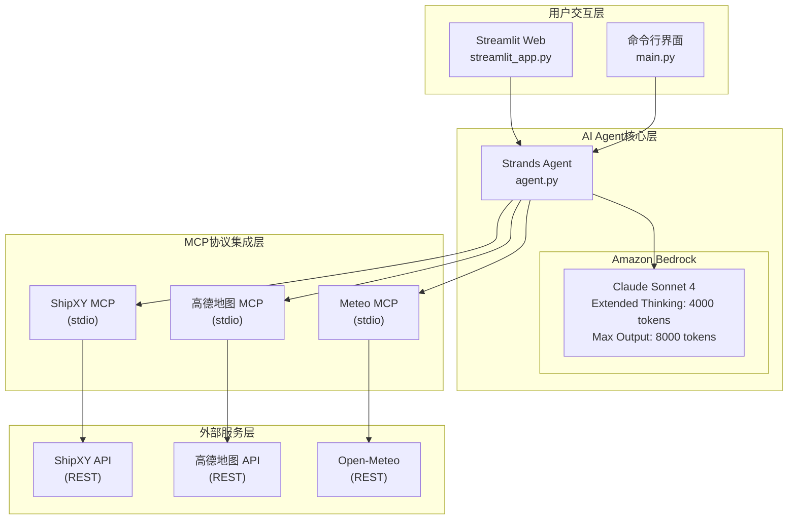
```mermaid
graph TB
    subgraph UI["用户交互层"]
        Web["Streamlit Web<br/>streamlit_app.py"]
        CLI["命令行界面<br/>main.py"]
    end
    
    subgraph Agent["AI Agent核心层"]
        StrandsAgent["Strands Agent<br/>agent.py"]
        subgraph Bedrock["Amazon Bedrock"]
            Claude["Claude Sonnet 4<br/>Extended Thinking: 4000 tokens<br/>Max Output: 8000 tokens"]
        end
    end
    
    subgraph MCP["MCP协议集成层"]
        ShipMCP["ShipXY MCP<br/>(stdio)"]
        MapMCP["高德地图 MCP<br/>(stdio)"]
        MeteoMCP["Meteo MCP<br/>(stdio)"]
    end
    
    subgraph External["外部服务层"]
        ShipAPI["ShipXY API<br/>(REST)"]
        MapAPI["高德地图 API<br/>(REST)"]
        MeteoAPI["Open-Meteo<br/>(REST)"]
    end
    
    Web --> StrandsAgent
    CLI --> StrandsAgent
    StrandsAgent --> Claude
    StrandsAgent --> ShipMCP
    StrandsAgent --> MapMCP
    StrandsAgent --> MeteoMCP
    ShipMCP --> ShipAPI
    MapMCP --> MapAPI
    MeteoMCP --> MeteoAPI
```

### 1.2 架构特点

1. **协议标准化**: 采用MCP协议统一外部服务接入
2. **模块解耦**: 各服务通过MCP Client独立管理
3. **智能编排**: AI Agent自主决策工具调用顺序
4. **扩展思考**: 支持Extended Thinking提升推理能力
5. **多模态交互**: 支持Web和CLI两种交互方式


## 2. 核心模块架构

### 2.1 AI Agent模块 (agent.py)

#### 架构设计

**ASCII流程图**:
```
┌─────────────────────────────────────────────────────────────┐
│                    Agent初始化流程                            │
│                                                               │
│  init_system()                                               │
│    │                                                          │
│    ├─► 创建MCP客户端                                         │
│    │   ├─► ShipXY MCP Client (stdio)                        │
│    │   ├─► 高德地图 MCP Client (stdio)                       │
│    │   └─► Open-Meteo MCP Client (stdio)                    │
│    │                                                          │
│    ├─► 启动MCP连接                                           │
│    │   └─► __enter__() 建立stdio通信                        │
│    │                                                          │
│    ├─► 获取工具列表                                          │
│    │   └─► list_tools_sync() 同步获取所有工具               │
│    │                                                          │
│    ├─► 创建Bedrock模型                                       │
│    │   ├─► model_id: claude-sonnet-4                        │
│    │   ├─► temperature: 1.0                                 │
│    │   ├─► max_tokens: 8000                                 │
│    │   └─► thinking_budget: 4000                            │
│    │                                                          │
│    └─► 创建Agent实例                                         │
│        ├─► 加载system_prompt                                │
│        ├─► 注册MCP工具                                       │
│        └─► 注册内置工具 (current_time, retrieve)            │
└─────────────────────────────────────────────────────────────┘
```

**Mermaid流程图**:
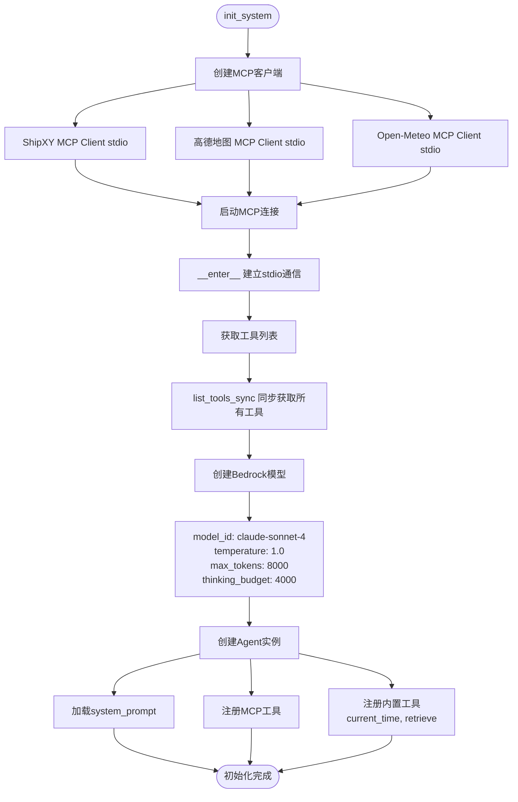
```mermaid
flowchart TD
    Start([init_system]) --> CreateClients[创建MCP客户端]
    CreateClients --> ShipClient[ShipXY MCP Client stdio]
    CreateClients --> MapClient[高德地图 MCP Client stdio]
    CreateClients --> MeteoClient[Open-Meteo MCP Client stdio]
    
    ShipClient --> StartConn[启动MCP连接]
    MapClient --> StartConn
    MeteoClient --> StartConn
    
    StartConn --> Enter[__enter__ 建立stdio通信]
    Enter --> GetTools[获取工具列表]
    GetTools --> ListTools[list_tools_sync 同步获取所有工具]
    
    ListTools --> CreateModel[创建Bedrock模型]
    CreateModel --> ModelConfig[model_id: claude-sonnet-4<br/>temperature: 1.0<br/>max_tokens: 8000<br/>thinking_budget: 4000]
    
    ModelConfig --> CreateAgent[创建Agent实例]
    CreateAgent --> LoadPrompt[加载system_prompt]
    CreateAgent --> RegMCP[注册MCP工具]
    CreateAgent --> RegBuiltin[注册内置工具<br/>current_time, retrieve]
    
    LoadPrompt --> End([初始化完成])
    RegMCP --> End
    RegBuiltin --> End
```

#### 关键组件

**1. MCP客户端管理**
- 使用`MCPClient`封装stdio通信
- 支持超时控制（30-60秒）
- 环境变量注入（API密钥）

**2. 工具集成**
- MCP工具：30+ ShipXY工具 + 高德地图 + 气象服务
- 内置工具：current_time, retrieve, calculator, file_read等

**3. 对话管理**
- 支持历史对话加载
- 消息格式转换（JSON ↔ Agent格式）
- 流式输出处理

#### 执行流程

**ASCII流程图**:
```
用户输入
  │
  ▼
解析输入（支持JSON历史对话）
  │
  ▼
Agent.stream_async()
  │
  ├─► Extended Thinking (推理过程)
  │   └─► [THINKING] 标记输出
  │
  └─► Response Generation (生成回答)
      └─► 流式输出文本
```

**Mermaid流程图**:
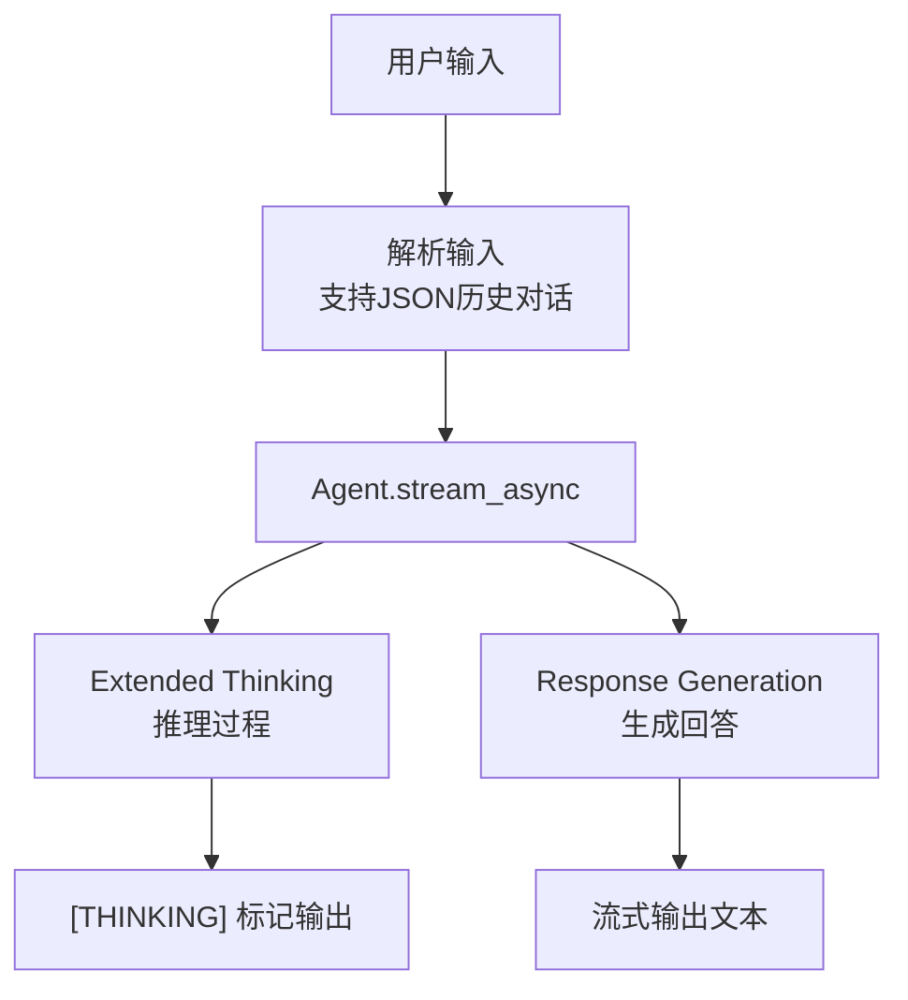
```mermaid
flowchart TD
    Input[用户输入] --> Parse[解析输入<br/>支持JSON历史对话]
    Parse --> Stream[Agent.stream_async]
    Stream --> Think[Extended Thinking<br/>推理过程]
    Think --> ThinkOut["[THINKING] 标记输出"]
    Stream --> Response[Response Generation<br/>生成回答]
    Response --> StreamOut[流式输出文本]
```


### 2.2 ShipXY MCP服务器模块 (shipxy-server.py)

#### 架构设计

**ASCII架构图**:
```
┌─────────────────────────────────────────────────────────────┐
│              ShipXY MCP Server架构                           │
│                                                               │
│  FastMCP Server                                              │
│    │                                                          │
│    ├─► 工具注册层 (@mcp.tool装饰器)                         │
│    │   ├─► search_ship                                      │
│    │   ├─► get_single_ship                                  │
│    │   ├─► get_many_ship                                    │
│    │   ├─► get_surrounding_ship                             │
│    │   ├─► search_port                                      │
│    │   ├─► plan_route_by_point                              │
│    │   └─► ... (30+工具)                                    │
│    │                                                          │
│    ├─► API封装层 (ShipxyAPI)                                │
│    │   └─► ship_service.py                                  │
│    │       ├─► HTTP请求封装                                 │
│    │       ├─► 响应解析                                     │
│    │       └─► 类型验证 (Pydantic)                          │
│    │                                                          │
│    └─► 传输层                                                │
│        ├─► SSE (Server-Sent Events)                         │
│        └─► Stdio (标准输入输出)                             │
└─────────────────────────────────────────────────────────────┘
```

**Mermaid架构图**:
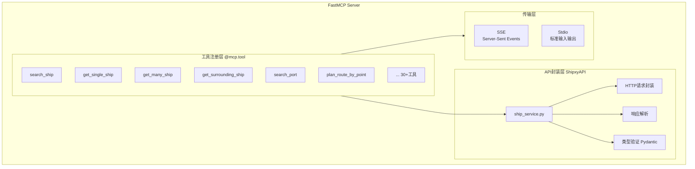
```mermaid
graph TB
    subgraph FastMCP["FastMCP Server"]
        subgraph Tools["工具注册层 @mcp.tool"]
            T1[search_ship]
            T2[get_single_ship]
            T3[get_many_ship]
            T4[get_surrounding_ship]
            T5[search_port]
            T6[plan_route_by_point]
            T7[... 30+工具]
        end
        
        subgraph API["API封装层 ShipxyAPI"]
            Service[ship_service.py]
            HTTP[HTTP请求封装]
            Parse[响应解析]
            Valid[类型验证 Pydantic]
        end
        
        subgraph Transport["传输层"]
            SSE[SSE<br/>Server-Sent Events]
            Stdio[Stdio<br/>标准输入输出]
        end
    end
    
    Tools --> Service
    Service --> HTTP
    Service --> Parse
    Service --> Valid
    Tools --> Transport
```

#### 工具分类

**船舶查询类** (8个工具)
- `search_ship`: 模糊搜索
- `get_single_ship`: 单船查询
- `get_many_ship`: 批量查询
- `get_fleet_ship`: 船队查询
- `get_surrounding_ship`: 周边船舶
- `get_area_ship`: 区域船舶
- `get_ship_registry`: 船籍信息
- `search_ship_particular`: 档案查询

**港口服务类** (5个工具)
- `search_port`: 港口搜索
- `get_berth_ships`: 泊位船舶
- `get_anchor_ships`: 锚地船舶
- `get_eta_ships`: 预计到港
- `get_port_of_call_by_port`: 港口历史

**航线规划类** (3个工具)
- `plan_route_by_point`: 点对点规划
- `plan_route_by_port`: 港口间规划
- `get_single_eta_precise`: 精确ETA

**气象服务类** (6个工具)
- `get_weather_by_point`: 点位天气
- `get_weather`: 天气查询
- `get_all_typhoon`: 台风列表
- `get_single_typhoon`: 单个台风
- `get_tides`: 潮汐信息
- `get_tide_data`: 潮汐数据

**追踪分析类** (8个工具)
- `get_ship_track`: 船舶轨迹
- `search_ship_approach`: 船舶接近
- `get_port_of_call_by_ship`: 船舶挂靠
- `get_port_of_call_by_ship_port`: 船港挂靠
- `get_ship_status`: 船舶状态
- 等


### 2.3 ShipXY API服务模块 (ship_service.py)

#### 架构设计

**ASCII架构图**:
```
┌─────────────────────────────────────────────────────────────┐
│                ShipxyAPI类架构                               │
│                                                               │
│  ShipxyAPI                                                   │
│    │                                                          │
│    ├─► 初始化                                                │
│    │   ├─► api_key: 认证密钥                                │
│    │   ├─► base_url: API基础地址                            │
│    │   └─► session: requests.Session                        │
│    │                                                          │
│    ├─► 请求方法                                              │
│    │   ├─► _request(endpoint, params)                       │
│    │   │   ├─► 构建完整URL                                  │
│    │   │   ├─► 添加API密钥                                  │
│    │   │   ├─► 发送HTTP请求                                 │
│    │   │   ├─► 错误处理                                     │
│    │   │   └─► 返回JSON                                     │
│    │   │                                                     │
│    │   └─► 30+业务方法                                      │
│    │       └─► 调用_request + Pydantic验证                  │
│    │                                                          │
│    └─► 响应模型 (Pydantic)                                  │
│        ├─► SearchShipResponse                               │
│        ├─► SingleShipResponse                               │
│        ├─► ManyShipResponse                                 │
│        ├─► SurRoundingShipResponse                          │
│        └─► ... (30+响应模型)                                │
└─────────────────────────────────────────────────────────────┘
```

**Mermaid架构图**:
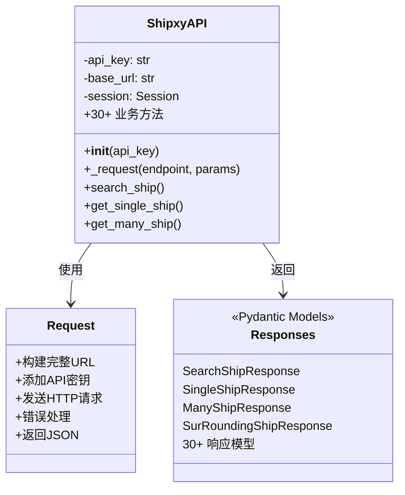
```mermaid
classDiagram
    class ShipxyAPI {
        -api_key: str
        -base_url: str
        -session: Session
        +__init__(api_key)
        +_request(endpoint, params)
        +search_ship()
        +get_single_ship()
        +get_many_ship()
        +30+ 业务方法
    }
    
    class Request {
        +构建完整URL
        +添加API密钥
        +发送HTTP请求
        +错误处理
        +返回JSON
    }
    
    class Responses {
        <<Pydantic Models>>
        SearchShipResponse
        SingleShipResponse
        ManyShipResponse
        SurRoundingShipResponse
        30+ 响应模型
    }
    
    ShipxyAPI --> Request : 使用
    ShipxyAPI --> Responses : 返回
```

#### 数据模型层次

**基础模型**
```python
ShipPosition (船舶位置基础模型)
├─► mmsi: int (水上移动业务标识码)
├─► imo: int (国际海事组织编号)
├─► ship_name: str (船名)
├─► lat/lng: float (经纬度)
├─► sog/cog: float (速度/航向)
└─► navistat: int (航行状态)
```

**响应模型**
```python
BaseResponse
├─► status: int (状态码)
├─► msg: str (消息)
└─► data: T (泛型数据)

具体响应类型
├─► SearchShipResponse (搜索结果)
├─► SingleShipResponse (单船数据)
├─► ManyShipResponse (多船数据)
└─► ... (30+类型)
```

#### 错误处理机制

**ASCII流程图**:
```
HTTP请求
  │
  ├─► 网络错误 → RequestException
  ├─► 超时错误 → Timeout
  ├─► API错误 → status != 0
  └─► 数据验证 → ValidationError
```

**Mermaid流程图**:
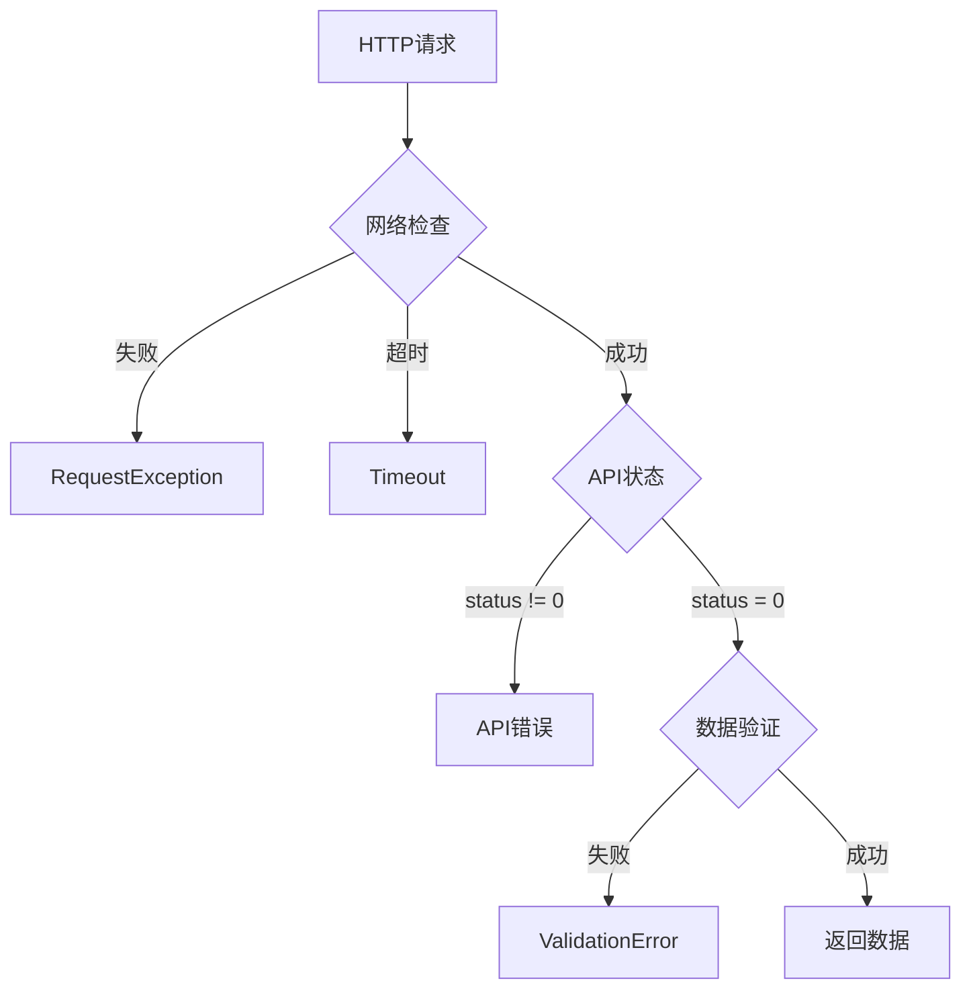
```mermaid
flowchart TD
    Request[HTTP请求] --> Network{网络检查}
    Network -->|失败| NetErr[RequestException]
    Network -->|超时| TimeErr[Timeout]
    Network -->|成功| API{API状态}
    API -->|status != 0| APIErr[API错误]
    API -->|status = 0| Valid{数据验证}
    Valid -->|失败| ValidErr[ValidationError]
    Valid -->|成功| Success[返回数据]
```


### 2.4 Streamlit前端模块 (streamlit_app.py)

#### 架构设计

**ASCII架构图**:
```
┌─────────────────────────────────────────────────────────────┐
│              Streamlit应用架构                               │
│                                                               │
│  页面层                                                       │
│    ├─► 页面配置 (set_page_config)                           │
│    ├─► 标题和说明                                            │
│    └─► 示例问题按钮 (3列布局)                               │
│                                                               │
│  会话状态管理                                                 │
│    ├─► messages: 显示消息列表                               │
│    ├─► conversation_history: 完整对话历史                   │
│    └─► thinking_history: 思考过程记录                       │
│                                                               │
│  交互层                                                       │
│    ├─► 历史消息展示                                          │
│    │   ├─► 用户消息                                         │
│    │   └─► 助手消息 + Thinking展开                          │
│    │                                                          │
│    ├─► 输入处理                                              │
│    │   ├─► 示例问题点击                                     │
│    │   └─► 聊天输入框                                       │
│    │                                                          │
│    └─► 响应处理                                              │
│        ├─► subprocess调用agent.py                           │
│        ├─► 实时流式输出                                     │
│        ├─► Thinking/Response分离                            │
│        └─► 状态更新和重渲染                                 │
│                                                               │
│  侧边栏                                                       │
│    ├─► 系统信息                                              │
│    ├─► 功能列表                                              │
│    ├─► 清空对话按钮                                          │
│    └─► 对话轮次统计                                          │
└─────────────────────────────────────────────────────────────┘
```

**Mermaid架构图**:
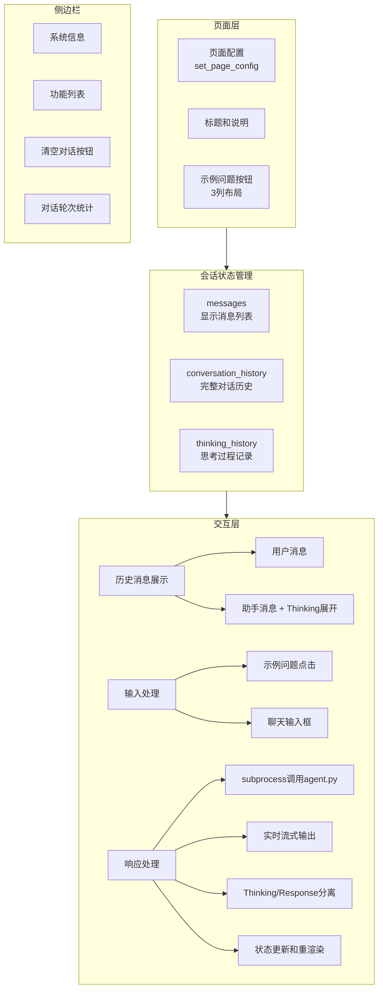
```mermaid
graph TB
    subgraph Page["页面层"]
        Config[页面配置<br/>set_page_config]
        Title[标题和说明]
        Examples[示例问题按钮<br/>3列布局]
    end
    
    subgraph State["会话状态管理"]
        Messages[messages<br/>显示消息列表]
        History[conversation_history<br/>完整对话历史]
        Thinking[thinking_history<br/>思考过程记录]
    end
    
    subgraph Interaction["交互层"]
        Display[历史消息展示]
        UserMsg[用户消息]
        AssistMsg[助手消息 + Thinking展开]
        
        Input[输入处理]
        ExClick[示例问题点击]
        ChatInput[聊天输入框]
        
        Response[响应处理]
        Subprocess[subprocess调用agent.py]
        Stream[实时流式输出]
        Split[Thinking/Response分离]
        Update[状态更新和重渲染]
    end
    
    subgraph Sidebar["侧边栏"]
        SysInfo[系统信息]
        Features[功能列表]
        Clear[清空对话按钮]
        Stats[对话轮次统计]
    end
    
    Page --> State
    State --> Interaction
    Display --> UserMsg
    Display --> AssistMsg
    Input --> ExClick
    Input --> ChatInput
    Response --> Subprocess
    Response --> Stream
    Response --> Split
    Response --> Update
```

#### 数据流

**ASCII流程图**:
```
用户输入
  │
  ▼
添加到conversation_history
  │
  ▼
JSON序列化历史对话
  │
  ▼
subprocess调用agent.py --messages
  │
  ├─► stdout实时读取
  │   ├─► [THINKING] → thinking_placeholder
  │   └─► 其他输出 → response_placeholder
  │
  ▼
更新会话状态
  │
  ├─► messages (显示用)
  ├─► conversation_history (对话历史)
  └─► thinking_history (思考记录)
  │
  ▼
st.rerun() 重新渲染
```

**Mermaid流程图**:
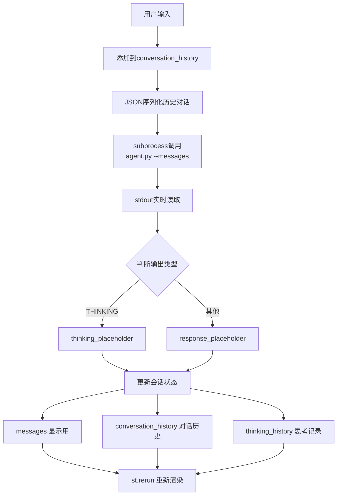
```mermaid
flowchart TD
    Input[用户输入] --> AddHist[添加到conversation_history]
    AddHist --> JSON[JSON序列化历史对话]
    JSON --> Subprocess[subprocess调用<br/>agent.py --messages]
    Subprocess --> Read[stdout实时读取]
    Read --> Think{判断输出类型}
    Think -->|THINKING| ThinkPlace[thinking_placeholder]
    Think -->|其他| RespPlace[response_placeholder]
    ThinkPlace --> Update[更新会话状态]
    RespPlace --> Update
    Update --> Msg[messages 显示用]
    Update --> Hist[conversation_history 对话历史]
    Update --> ThinkHist[thinking_history 思考记录]
    Msg --> Rerun[st.rerun 重新渲染]
    Hist --> Rerun
    ThinkHist --> Rerun
```

#### 关键特性

**1. 会话持久化**
- 使用`st.session_state`保存对话
- 支持多轮对话上下文
- 思考过程独立存储

**2. 实时流式输出**
- subprocess.Popen非阻塞调用
- 逐行读取stdout
- 区分thinking和response

**3. 用户体验优化**
- 示例问题快捷按钮
- Thinking过程可折叠
- 对话轮次统计
- 清空对话功能


## 3. 时序图

### 3.1 系统初始化时序

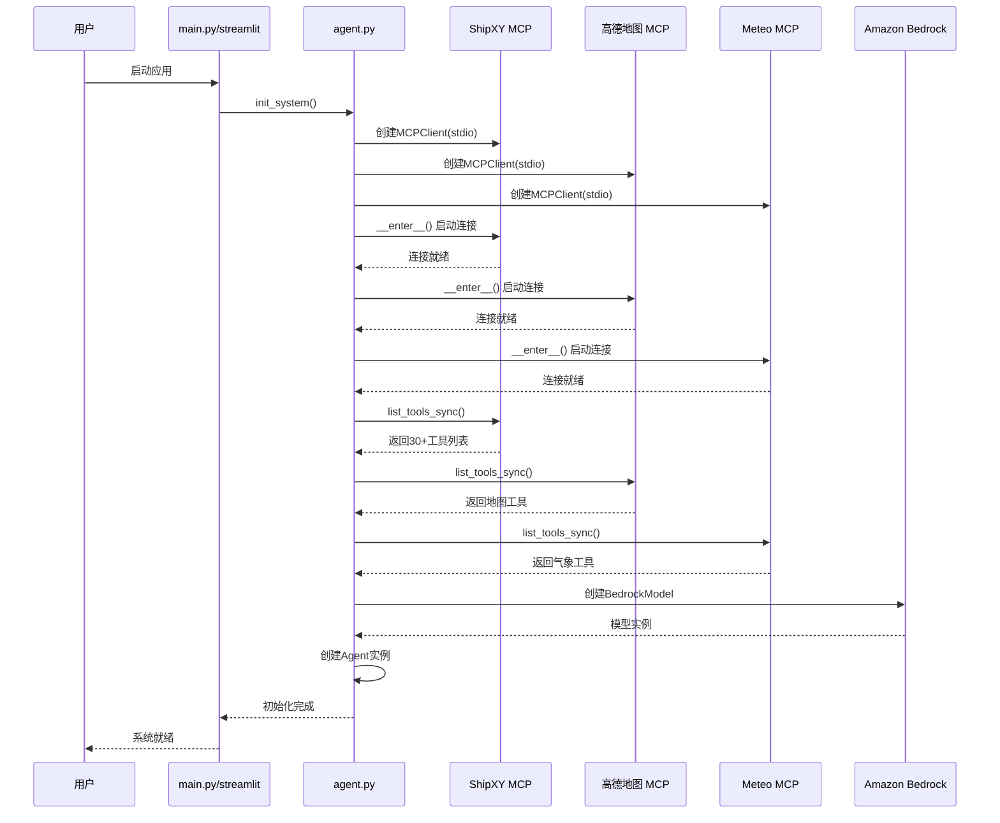
```mermaid
sequenceDiagram
    participant User as 用户
    participant Main as main.py/streamlit
    participant Agent as agent.py
    participant MCP1 as ShipXY MCP
    participant MCP2 as 高德地图 MCP
    participant MCP3 as Meteo MCP
    participant Bedrock as Amazon Bedrock

    User->>Main: 启动应用
    Main->>Agent: init_system()
    
    Agent->>MCP1: 创建MCPClient(stdio)
    Agent->>MCP2: 创建MCPClient(stdio)
    Agent->>MCP3: 创建MCPClient(stdio)
    
    Agent->>MCP1: __enter__() 启动连接
    MCP1-->>Agent: 连接就绪
    
    Agent->>MCP2: __enter__() 启动连接
    MCP2-->>Agent: 连接就绪
    
    Agent->>MCP3: __enter__() 启动连接
    MCP3-->>Agent: 连接就绪
    
    Agent->>MCP1: list_tools_sync()
    MCP1-->>Agent: 返回30+工具列表
    
    Agent->>MCP2: list_tools_sync()
    MCP2-->>Agent: 返回地图工具
    
    Agent->>MCP3: list_tools_sync()
    MCP3-->>Agent: 返回气象工具
    
    Agent->>Bedrock: 创建BedrockModel
    Bedrock-->>Agent: 模型实例
    
    Agent->>Agent: 创建Agent实例
    Agent-->>Main: 初始化完成
    Main-->>User: 系统就绪
```

### 3.2 用户查询处理时序

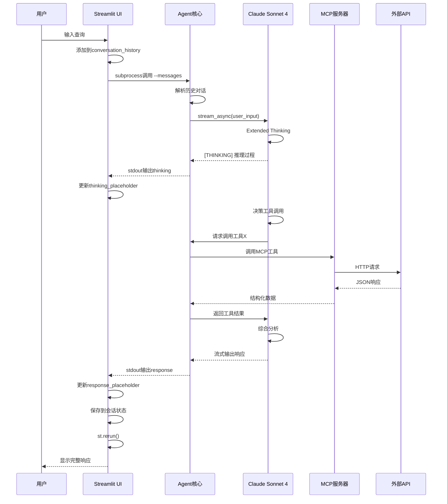
```mermaid
sequenceDiagram
    participant User as 用户
    participant UI as Streamlit UI
    participant Agent as Agent核心
    participant LLM as Claude Sonnet 4
    participant MCP as MCP服务器
    participant API as 外部API

    User->>UI: 输入查询
    UI->>UI: 添加到conversation_history
    UI->>Agent: subprocess调用 --messages
    
    Agent->>Agent: 解析历史对话
    Agent->>LLM: stream_async(user_input)
    
    LLM->>LLM: Extended Thinking
    LLM-->>Agent: [THINKING] 推理过程
    Agent-->>UI: stdout输出thinking
    UI->>UI: 更新thinking_placeholder
    
    LLM->>LLM: 决策工具调用
    LLM->>Agent: 请求调用工具X
    
    Agent->>MCP: 调用MCP工具
    MCP->>API: HTTP请求
    API-->>MCP: JSON响应
    MCP-->>Agent: 结构化数据
    
    Agent->>LLM: 返回工具结果
    LLM->>LLM: 综合分析
    
    LLM-->>Agent: 流式输出响应
    Agent-->>UI: stdout输出response
    UI->>UI: 更新response_placeholder
    
    UI->>UI: 保存到会话状态
    UI->>UI: st.rerun()
    UI-->>User: 显示完整响应
```

### 3.3 多工具协作时序

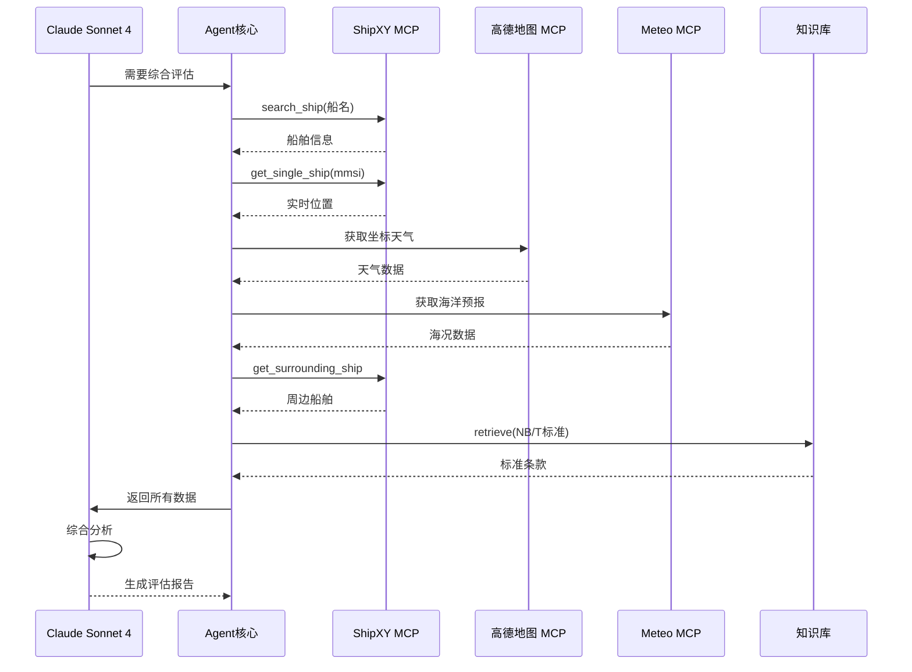
```mermaid
sequenceDiagram
    participant LLM as Claude Sonnet 4
    participant Agent as Agent核心
    participant Ship as ShipXY MCP
    participant Map as 高德地图 MCP
    participant Weather as Meteo MCP
    participant KB as 知识库

    LLM->>Agent: 需要综合评估
    
    Agent->>Ship: search_ship(船名)
    Ship-->>Agent: 船舶信息
    
    Agent->>Ship: get_single_ship(mmsi)
    Ship-->>Agent: 实时位置
    
    Agent->>Map: 获取坐标天气
    Map-->>Agent: 天气数据
    
    Agent->>Weather: 获取海洋预报
    Weather-->>Agent: 海况数据
    
    Agent->>Ship: get_surrounding_ship
    Ship-->>Agent: 周边船舶
    
    Agent->>KB: retrieve(NB/T标准)
    KB-->>Agent: 标准条款
    
    Agent->>LLM: 返回所有数据
    LLM->>LLM: 综合分析
    LLM-->>Agent: 生成评估报告
```


## 4. 数据流图

### 4.1 整体数据流

```
┌──────────────────────────────────────────────────────────────┐
│                        用户输入                               │
│                    (文本查询/问题)                            │
└──────────────────────────────────────────────────────────────┘
                            │
                            ▼
┌──────────────────────────────────────────────────────────────┐
│                    前端处理层                                 │
│  ┌────────────────────────────────────────────────────────┐  │
│  │  Streamlit/CLI                                         │  │
│  │  • 会话状态管理                                        │  │
│  │  • 历史对话序列化                                      │  │
│  │  • JSON格式转换                                        │  │
│  └────────────────────────────────────────────────────────┘  │
└──────────────────────────────────────────────────────────────┘
                            │
                            ▼ JSON消息列表
┌──────────────────────────────────────────────────────────────┐
│                    Agent处理层                                │
│  ┌────────────────────────────────────────────────────────┐  │
│  │  Agent核心 (agent.py)                                  │  │
│  │  • 消息解析                                            │  │
│  │  • 上下文加载                                          │  │
│  │  • 流式处理                                            │  │
│  └────────────────────────────────────────────────────────┘  │
└──────────────────────────────────────────────────────────────┘
                            │
                            ▼ 用户消息 + 历史
┌──────────────────────────────────────────────────────────────┐
│                    LLM推理层                                  │
│  ┌────────────────────────────────────────────────────────┐  │
│  │  Amazon Bedrock (Claude Sonnet 4)                      │  │
│  │  ┌──────────────────────────────────────────────────┐  │  │
│  │  │  Extended Thinking                               │  │  │
│  │  │  • 意图识别                                      │  │  │
│  │  │  • 任务分解                                      │  │  │
│  │  │  • 工具选择                                      │  │  │
│  │  │  • 执行规划                                      │  │  │
│  │  └──────────────────────────────────────────────────┘  │  │
│  │  ┌──────────────────────────────────────────────────┐  │  │
│  │  │  Tool Calling                                    │  │  │
│  │  │  • 工具参数构造                                  │  │  │
│  │  │  • 多工具编排                                    │  │  │
│  │  └──────────────────────────────────────────────────┘  │  │
│  └────────────────────────────────────────────────────────┘  │
└──────────────────────────────────────────────────────────────┘
                            │
                            ▼ 工具调用请求
┌──────────────────────────────────────────────────────────────┐
│                    MCP协议层                                  │
│  ┌──────────┐      ┌──────────┐      ┌──────────┐          │
│  │ ShipXY   │      │ 高德地图  │      │ Meteo    │          │
│  │ MCP      │      │ MCP      │      │ MCP      │          │
│  │ Client   │      │ Client   │      │ Client   │          │
│  └──────────┘      └──────────┘      └──────────┘          │
│       │                  │                  │                │
│       ▼ stdio            ▼ stdio            ▼ stdio         │
│  ┌──────────┐      ┌──────────┐      ┌──────────┐          │
│  │ ShipXY   │      │ 高德地图  │      │ Meteo    │          │
│  │ MCP      │      │ MCP      │      │ MCP      │          │
│  │ Server   │      │ Server   │      │ Server   │          │
│  └──────────┘      └──────────┘      └──────────┘          │
└──────────────────────────────────────────────────────────────┘
                            │
                            ▼ HTTP请求
┌──────────────────────────────────────────────────────────────┐
│                    外部API层                                  │
│  ┌──────────┐      ┌──────────┐      ┌──────────┐          │
│  │ ShipXY   │      │ 高德地图  │      │ Open     │          │
│  │ REST API │      │ REST API │      │ Meteo    │          │
│  └──────────┘      └──────────┘      └──────────┘          │
└──────────────────────────────────────────────────────────────┘
                            │
                            ▼ JSON响应
┌──────────────────────────────────────────────────────────────┐
│                    数据处理层                                 │
│  • Pydantic模型验证                                          │
│  • 类型转换                                                  │
│  • 错误处理                                                  │
└──────────────────────────────────────────────────────────────┘
                            │
                            ▼ 结构化数据
                    返回到LLM推理层
                            │
                            ▼ 综合分析
┌──────────────────────────────────────────────────────────────┐
│                    响应生成层                                 │
│  • 数据整合                                                  │
│  • 标准引用                                                  │
│  • 风险评估                                                  │
│  • 建议生成                                                  │
└──────────────────────────────────────────────────────────────┘
                            │
                            ▼ 流式文本
┌──────────────────────────────────────────────────────────────┐
│                    输出展示层                                 │
│  • Thinking过程展示                                          │
│  • 响应内容展示                                              │
│  • 会话状态更新                                              │
└──────────────────────────────────────────────────────────────┘
                            │
                            ▼
                        用户查看结果
```

### 4.2 MCP通信数据流

**ASCII流程图**:
```
Agent进程                    MCP Server进程
    │                            │
    │  创建stdio连接              │
    ├───────────────────────────►│
    │                            │
    │  list_tools请求            │
    ├───────────────────────────►│
    │                            │ 解析请求
    │                            │ 返回工具列表
    │  ◄───────────────────────┤
    │  工具列表JSON              │
    │                            │
    │  call_tool请求             │
    │  {name, arguments}         │
    ├───────────────────────────►│
    │                            │ 调用ShipxyAPI
    │                            │ HTTP请求外部API
    │                            │ 获取JSON响应
    │                            │ Pydantic验证
    │  ◄───────────────────────┤
    │  工具结果JSON              │
    │                            │
```

**Mermaid时序图**:
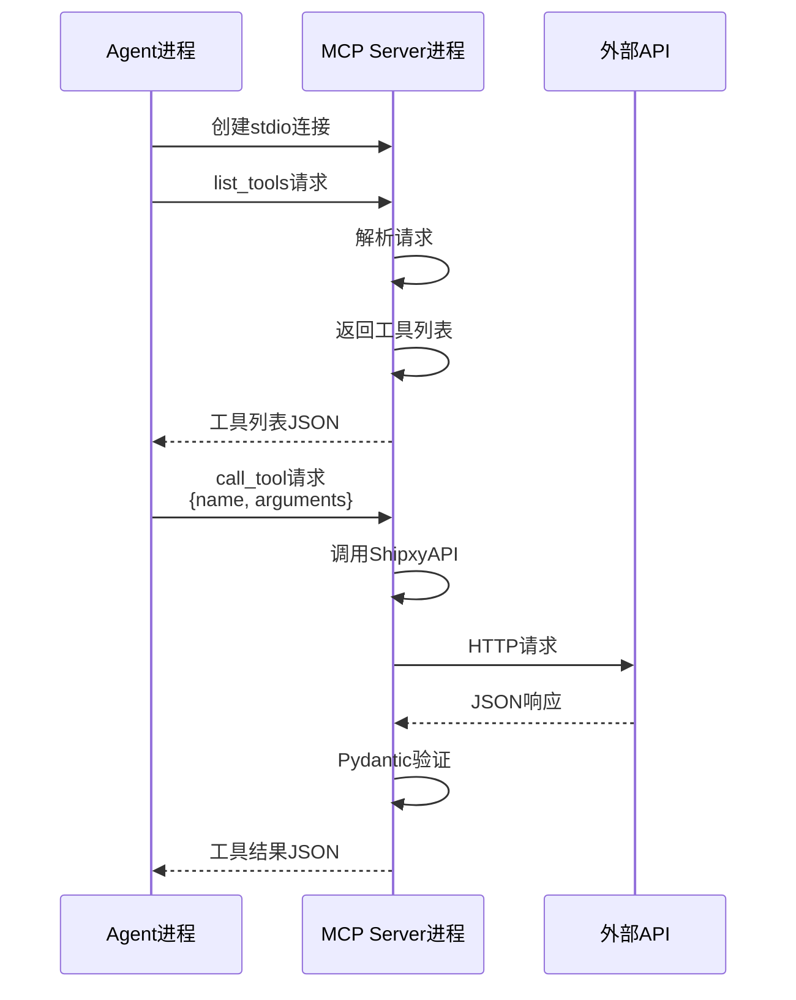
```mermaid
sequenceDiagram
    participant Agent as Agent进程
    participant MCP as MCP Server进程
    participant API as 外部API
    
    Agent->>MCP: 创建stdio连接
    Agent->>MCP: list_tools请求
    MCP->>MCP: 解析请求
    MCP->>MCP: 返回工具列表
    MCP-->>Agent: 工具列表JSON
    
    Agent->>MCP: call_tool请求<br/>{name, arguments}
    MCP->>MCP: 调用ShipxyAPI
    MCP->>API: HTTP请求
    API-->>MCP: JSON响应
    MCP->>MCP: Pydantic验证
    MCP-->>Agent: 工具结果JSON
```

### 4.3 会话状态数据流

**ASCII流程图**:
```
Streamlit会话状态
┌─────────────────────────────────────┐
│ st.session_state                    │
│                                     │
│ messages: [                         │
│   {role: "user", content: "..."}   │
│   {role: "assistant", content: ""}  │
│ ]                                   │
│                                     │
│ conversation_history: [             │
│   {role: "user", content: "..."}   │
│   {role: "assistant", content: ""}  │
│ ]                                   │
│                                     │
│ thinking_history: [                 │
│   "thinking text 1",                │
│   "thinking text 2"                 │
│ ]                                   │
└─────────────────────────────────────┘
        │
        ▼ JSON序列化
┌─────────────────────────────────────┐
│ JSON字符串                          │
│ '[{"role":"user","content":"..."}]' │
└─────────────────────────────────────┘
        │
        ▼ subprocess参数
┌─────────────────────────────────────┐
│ agent.py --messages '...'           │
└─────────────────────────────────────┘
        │
        ▼ 解析
┌─────────────────────────────────────┐
│ Agent内部消息格式                   │
│ [                                   │
│   {role: "user",                    │
│    content: [{"text": "..."}]}      │
│ ]                                   │
└─────────────────────────────────────┘
```

**Mermaid流程图**:
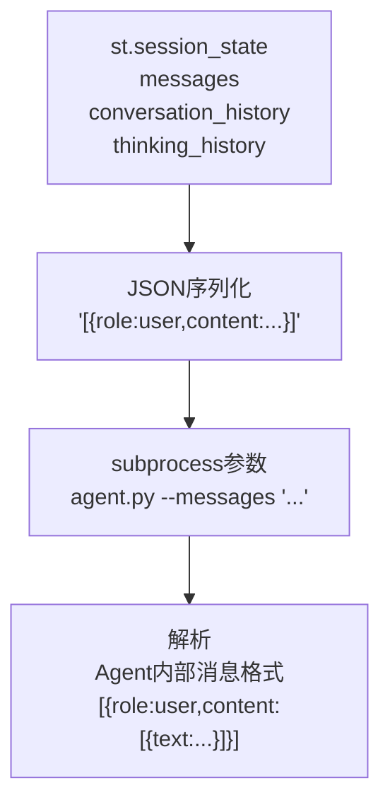
```mermaid
flowchart TD
    State["st.session_state<br/>messages<br/>conversation_history<br/>thinking_history"]
    JSON["JSON序列化<br/>'[{role:user,content:...}]'"]
    Subprocess["subprocess参数<br/>agent.py --messages '...'"]
    Parse["解析<br/>Agent内部消息格式<br/>[{role:user,content:[{text:...}]}]"]
    
    State --> JSON
    JSON --> Subprocess
    Subprocess --> Parse
```


## 5. 关键概念定义

### 5.1 MCP (Model Context Protocol)

**定义**: Model Context Protocol是一个开放协议，用于标准化应用程序向大语言模型提供上下文的方式。

**核心组件**:
- **MCP Server**: 提供工具和资源的服务端
- **MCP Client**: 连接到服务器的客户端
- **Transport**: 通信传输层（stdio、SSE、HTTP）

**在本项目中的应用**:
```python
# MCP Client创建
_amap_client = MCPClient(
    lambda: stdio_client(
        StdioServerParameters(
            command="npx",
            args=["-y","@amap/amap-maps-mcp-server"],
            env={"AMAP_MAPS_API_KEY": os.getenv("AMAP_MAPS_API_KEY")}
        )
    ),
    startup_timeout=30
)
```

**优势**:
1. 标准化接口：统一的工具调用方式
2. 进程隔离：MCP Server独立运行
3. 语言无关：支持多种编程语言
4. 易于扩展：新增服务只需实现MCP协议

### 5.2 Strands Agents

**定义**: Strands Agents是一个用于构建AI Agent的Python框架，提供了与LLM交互、工具调用、状态管理等核心功能。

**核心概念**:
- **Agent**: 智能体实例，封装模型和工具
- **Model**: LLM模型接口（支持Bedrock、OpenAI等）
- **Tool**: 可被Agent调用的函数
- **System Prompt**: 定义Agent的角色和行为

**关键特性**:
```python
agent = Agent(
    model=BedrockModel(...),
    system_prompt="你是海上风电巡检专家...",
    tools=[tool1, tool2, ...],
    callback_handler=None
)
```

### 5.3 Extended Thinking

**定义**: Claude模型的扩展思考功能，允许模型在生成响应前进行更深入的推理。

**配置方式**:
```python
additional_request_fields={
    "thinking": {
        "type": "enabled",
        "budget_tokens": 4000  # 思考预算
    }
}
```

**工作原理**:
1. 模型接收用户输入
2. 进入Extended Thinking模式
3. 使用budget_tokens进行推理
4. 输出thinking过程（可选）
5. 生成最终响应

**在本项目中的体现**:
- `[THINKING]`标记的输出
- 独立的thinking_history存储
- Streamlit中的可折叠展示

### 5.4 MMSI (Maritime Mobile Service Identity)

**定义**: 水上移动业务标识码，九位数字码，用于船舶无线电通信系统中唯一识别船舶。

**格式**: MIDXXXXXX
- MID (前3位): 国家/地区代码
- 后6位: 船舶唯一标识

**特点**:
- 全球唯一性（一船一码）
- 可能变更（船舶转售）
- AIS系统核心标识

**示例**: 440200920
- 440: 中国韩国
- 200920: 船舶编号

### 5.5 IMO (International Maritime Organization Number)

**定义**: 国际海事组织编号，七位数字，船舶的永久唯一识别码。

**特点**:
- 终身不变（即使船舶转售）
- 全球统一管理
- 用于追踪船舶历史

**与MMSI的区别**:
| 特性 | MMSI | IMO |
|------|------|-----|
| 位数 | 9位 | 7位 |
| 唯一性 | 可能变更 | 终身不变 |
| 用途 | 通信识别 | 身份追踪 |
| 管理 | 各国分配 | IMO统一 |

### 5.6 AIS (Automatic Identification System)

**定义**: 船舶自动识别系统，通过VHF无线电自动广播船舶信息。

**传输信息**:
- 静态信息: MMSI、IMO、船名、尺寸
- 动态信息: 位置、速度、航向、航行状态
- 航次信息: 目的港、ETA、吃水

**更新频率**:
- 航行中: 2-10秒
- 锚泊中: 3分钟
- 静态信息: 6分钟或变更时

### 5.7 NB/T 11768-2025标准

**全称**: 《海上风电场工程水域安全管理技术导则》

**主要内容**:
1. 水域安全管理要求
2. 船舶交通安全距离规定
3. 气象海况限制条件
4. 人员安全防护要求
5. 应急响应机制

**在系统中的应用**:
- 通过retrieve工具查询标准条款
- 作为风险评估的依据
- 生成合规性判断

### 5.8 Pydantic模型

**定义**: Python的数据验证库，使用类型注解进行运行时验证。

**在项目中的应用**:
```python
class ShipPosition(BaseModel):
    mmsi: int
    lat: float
    lng: float
    sog: float
    # 自动验证类型和必填项
```

**优势**:
1. 类型安全：编译时和运行时检查
2. 自动验证：数据格式和范围
3. JSON序列化：自动转换
4. IDE支持：代码补全和提示

### 5.9 Stdio通信

**定义**: 标准输入输出通信方式，通过stdin/stdout进行进程间通信。

**在MCP中的应用**:
```
Agent进程 ←→ stdin/stdout ←→ MCP Server进程
```

**优势**:
- 简单可靠
- 跨平台支持
- 进程隔离
- 易于调试

**数据格式**: JSON-RPC 2.0
```json
{
  "jsonrpc": "2.0",
  "method": "tools/call",
  "params": {...},
  "id": 1
}
```

### 5.10 SSE (Server-Sent Events)

**定义**: 服务器推送技术，允许服务器向客户端推送实时更新。

**在项目中的应用**:
- ShipXY MCP Server支持SSE传输
- 用于Web环境的MCP通信
- 单向推送（服务器→客户端）

**与WebSocket的区别**:
| 特性 | SSE | WebSocket |
|------|-----|-----------|
| 方向 | 单向 | 双向 |
| 协议 | HTTP | WS |
| 重连 | 自动 | 手动 |
| 复杂度 | 低 | 高 |

### 5.11 Bedrock模型配置

**关键参数**:
```python
model_id: "us.anthropic.claude-sonnet-4-20250514-v1:0"
temperature: 1.0        # 创造性（0-1）
max_tokens: 8000        # 最大输出长度
thinking_budget: 4000   # 思考token预算
```

**temperature说明**:
- 0.0: 确定性输出，适合精确任务
- 1.0: 平衡创造性和准确性
- 2.0: 高创造性，可能不稳定

**token预算分配**:
- thinking: 4000 tokens (推理)
- output: 8000 tokens (响应)
- 总计: 12000 tokens

### 5.12 FastMCP

**定义**: 快速构建MCP服务器的Python框架。

**核心特性**:
```python
mcp = FastMCP("server_name")

@mcp.tool()
def my_tool(param: str) -> Response:
    """工具描述"""
    return result
```

**自动功能**:
1. 工具注册和发现
2. 参数验证
3. 错误处理
4. 文档生成
5. 多传输支持（stdio/SSE）


## 6. 部署架构

### 6.1 AWS云部署架构

**ASCII架构图**:
```
┌─────────────────────────────────────────────────────────────┐
│                        Internet                              │
└─────────────────────────────────────────────────────────────┘
                            │
                            ▼
┌─────────────────────────────────────────────────────────────┐
│                  Application Load Balancer                   │
│                    (公网访问入口)                            │
└─────────────────────────────────────────────────────────────┘
                            │
                ┌───────────┴───────────┐
                ▼                       ▼
┌──────────────────────┐    ┌──────────────────────┐
│  Target Group 1      │    │  Target Group 2      │
│  (Frontend:8501)     │    │  (Backend:8000)      │
└──────────────────────┘    └──────────────────────┘
                │                       │
                ▼                       ▼
┌─────────────────────────────────────────────────────────────┐
│                      VPC (2 AZs)                             │
│  ┌────────────────────────────────────────────────────────┐ │
│  │              ECS Fargate Cluster                       │ │
│  │                                                         │ │
│  │  ┌──────────────────┐      ┌──────────────────┐      │ │
│  │  │  Frontend Task   │      │  Backend Task    │      │ │
│  │  │  ┌────────────┐  │      │  ┌────────────┐  │      │ │
│  │  │  │ Streamlit  │  │      │  │  FastAPI   │  │      │ │
│  │  │  │ Container  │  │      │  │  + MCP     │  │      │ │
│  │  │  │ (8501)     │  │      │  │  (8000)    │  │      │ │
│  │  │  └────────────┘  │      │  └────────────┘  │      │ │
│  │  │  • 2048MB RAM    │      │  • 2048MB RAM    │      │ │
│  │  │  • 1024 CPU      │      │  • 1024 CPU      │      │ │
│  │  └──────────────────┘      └──────────────────┘      │ │
│  └────────────────────────────────────────────────────────┘ │
│                                                              │
│  ┌────────────────────────────────────────────────────────┐ │
│  │              Private Subnets                           │ │
│  │  • NAT Gateway (出站访问)                              │ │
│  │  • Security Groups (访问控制)                          │ │
│  └────────────────────────────────────────────────────────┘ │
└─────────────────────────────────────────────────────────────┘
                            │
                            ▼
┌─────────────────────────────────────────────────────────────┐
│                    AWS Services                              │
│  ┌──────────────┐  ┌──────────────┐  ┌──────────────┐     │
│  │   Bedrock    │  │  CloudWatch  │  │     IAM      │     │
│  │   (LLM)      │  │   (Logs)     │  │   (Roles)    │     │
│  └──────────────┘  └──────────────┘  └──────────────┘     │
└─────────────────────────────────────────────────────────────┘
```

**Mermaid架构图**:
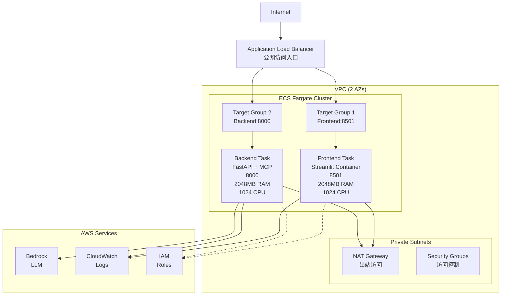
```mermaid
graph TB
    Internet[Internet] --> ALB[Application Load Balancer<br/>公网访问入口]
    
    ALB --> TG1[Target Group 1<br/>Frontend:8501]
    ALB --> TG2[Target Group 2<br/>Backend:8000]
    
    subgraph VPC["VPC (2 AZs)"]
        subgraph ECS[ECS Fargate Cluster]
            TG1 --> Frontend[Frontend Task<br/>Streamlit Container<br/>8501<br/>2048MB RAM<br/>1024 CPU]
            TG2 --> Backend[Backend Task<br/>FastAPI + MCP<br/>8000<br/>2048MB RAM<br/>1024 CPU]
        end
        
        subgraph Private[Private Subnets]
            NAT[NAT Gateway<br/>出站访问]
            SG[Security Groups<br/>访问控制]
        end
    end
    
    subgraph AWS[AWS Services]
        Bedrock[Bedrock<br/>LLM]
        CloudWatch[CloudWatch<br/>Logs]
        IAM[IAM<br/>Roles]
    end
    
    Frontend --> NAT
    Backend --> NAT
    Backend --> Bedrock
    Frontend --> CloudWatch
    Backend --> CloudWatch
    Frontend -.-> IAM
    Backend -.-> IAM
```

### 6.2 容器架构

**Frontend容器**:
```dockerfile
FROM python:3.11-slim
WORKDIR /app
COPY requirements.txt .
RUN pip install -r requirements.txt
COPY streamlit_app.py .
EXPOSE 8501
CMD ["streamlit", "run", "streamlit_app.py"]
```

**Backend容器**:
```dockerfile
FROM python:3.11-slim
WORKDIR /app
COPY requirements.txt .
RUN pip install -r requirements.txt
COPY shipxy-server.py ship_service.py .
EXPOSE 8000
CMD ["python", "shipxy-server.py"]
```

### 6.3 网络架构

**ASCII架构图**:
```
Internet
    │
    ▼
ALB (公网)
    │
    ├─► Frontend Service (8501)
    │   └─► Streamlit容器
    │       └─► 调用Backend (内网)
    │
    └─► Backend Service (8000)
        └─► FastAPI + MCP容器
            ├─► ShipXY API (外网)
            ├─► 高德地图 API (外网)
            ├─► Open-Meteo API (外网)
            └─► Bedrock (AWS内网)
```

**Mermaid架构图**:
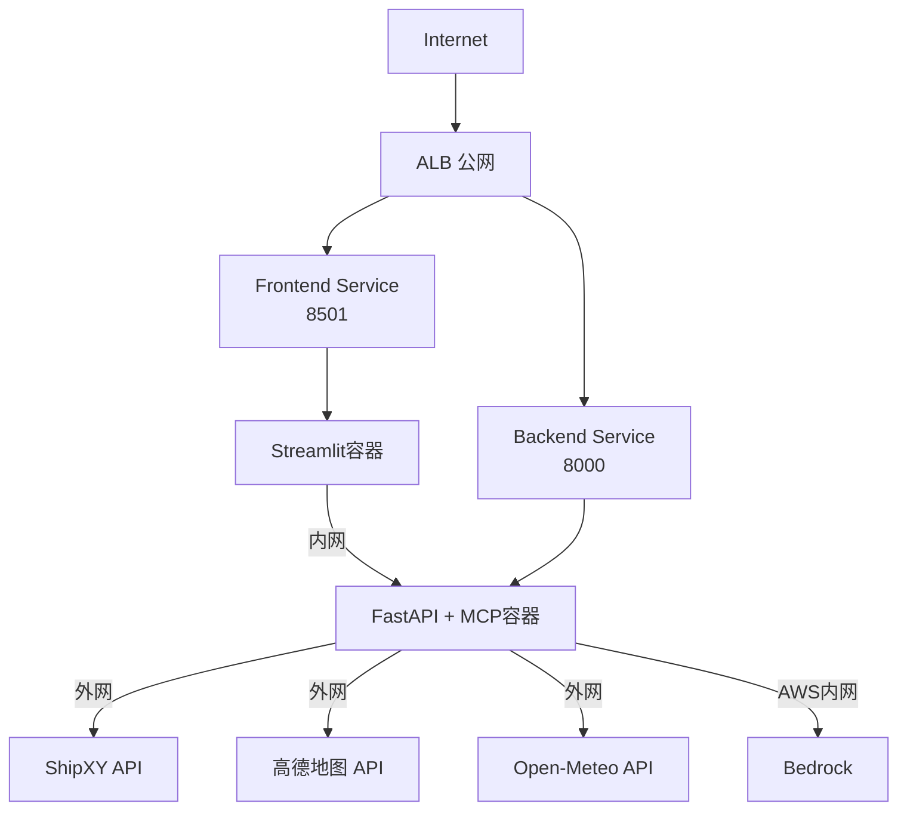
```mermaid
graph TD
    Internet[Internet] --> ALB[ALB 公网]
    
    ALB --> Frontend[Frontend Service<br/>8501]
    ALB --> Backend[Backend Service<br/>8000]
    
    Frontend --> StreamlitC[Streamlit容器]
    StreamlitC -->|内网| BackendC[Backend容器]
    
    Backend --> BackendC[FastAPI + MCP容器]
    BackendC -->|外网| ShipAPI[ShipXY API]
    BackendC -->|外网| MapAPI[高德地图 API]
    BackendC -->|外网| MeteoAPI[Open-Meteo API]
    BackendC -->|AWS内网| Bedrock[Bedrock]
```

### 6.4 IAM权限架构

**ASCII架构图**:
```
OffshoreWindTaskRole
├─► AmazonBedrockFullAccess
│   └─► 调用Bedrock模型
└─► CloudWatchLogsFullAccess
    └─► 写入日志

OffshoreWindExecutionRole
└─► AmazonECSTaskExecutionRolePolicy
    ├─► 拉取ECR镜像
    ├─► 写入CloudWatch日志
    └─► 读取Secrets Manager
```

**Mermaid架构图**:
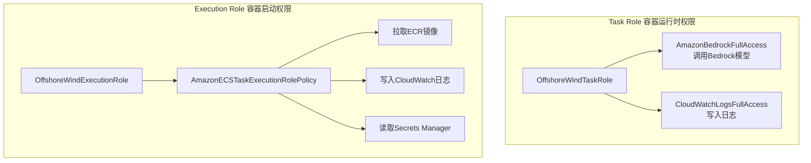
```mermaid
graph TB
    subgraph TaskRole[Task Role 容器运行时权限]
        TR[OffshoreWindTaskRole]
        TR --> Bedrock[AmazonBedrockFullAccess<br/>调用Bedrock模型]
        TR --> CWLogs[CloudWatchLogsFullAccess<br/>写入日志]
    end
    
    subgraph ExecRole[Execution Role 容器启动权限]
        ER[OffshoreWindExecutionRole]
        ER --> ECS[AmazonECSTaskExecutionRolePolicy]
        ECS --> ECR[拉取ECR镜像]
        ECS --> CW[写入CloudWatch日志]
        ECS --> SM[读取Secrets Manager]
    end
```

### 6.5 日志架构

**ASCII架构图**:
```
ECS Tasks
    │
    ├─► Backend Container
    │   └─► stdout/stderr
    │       └─► CloudWatch Logs
    │           └─► /ecs/offshore-wind-backend
    │
    └─► Frontend Container
        └─► stdout/stderr
            └─► CloudWatch Logs
                └─► /ecs/offshore-wind-frontend
```

**Mermaid架构图**:
```mermaid
graph TD
    ECS[ECS Tasks] --> Backend[Backend Container]
    ECS --> Frontend[Frontend Container]
    
    Backend --> BStdout[stdout/stderr]
    BStdout --> BCW[CloudWatch Logs]
    BCW --> BLog[/ecs/offshore-wind-backend<br/>保留7天]
    
    Frontend --> FStdout[stdout/stderr]
    FStdout --> FCW[CloudWatch Logs]
    FCW --> FLog[/ecs/offshore-wind-frontend<br/>保留7天]
```

**日志保留策略**: 7天  
**日志格式**: JSON结构化日志


## 7. 技术决策分析

### 7.1 为什么选择MCP协议？

**决策理由**:
1. **标准化**: 统一的工具接入方式，降低集成复杂度
2. **解耦**: 服务独立运行，互不影响
3. **扩展性**: 新增服务只需实现MCP协议
4. **生态**: 支持多种语言和框架

**替代方案对比**:
| 方案 | 优势 | 劣势 | 选择理由 |
|------|------|------|----------|
| MCP | 标准化、解耦 | 需要额外进程 | ✅ 长期维护性好 |
| 直接API调用 | 简单直接 | 耦合度高 | ❌ 难以扩展 |
| 自定义协议 | 灵活 | 维护成本高 | ❌ 重复造轮子 |

### 7.2 为什么选择Strands Agents？

**决策理由**:
1. **MCP原生支持**: 内置MCPClient
2. **Bedrock集成**: 官方支持Amazon Bedrock
3. **流式输出**: 支持stream_async
4. **工具管理**: 简化工具注册和调用

**与LangChain对比**:
| 特性 | Strands | LangChain |
|------|---------|-----------|
| MCP支持 | 原生 | 需要适配 |
| Bedrock | 官方 | 社区 |
| 学习曲线 | 平缓 | 陡峭 |
| 文档 | 清晰 | 复杂 |

### 7.3 为什么选择Streamlit？

**决策理由**:
1. **快速开发**: 纯Python，无需前端知识
2. **实时交互**: 自动重渲染
3. **会话管理**: 内置session_state
4. **组件丰富**: 开箱即用的UI组件

**替代方案**:
- Gradio: 更适合ML模型展示
- Flask/FastAPI: 需要前端开发
- Chainlit: 专注对话，功能单一

### 7.4 为什么使用subprocess调用？

**决策理由**:
1. **进程隔离**: Agent崩溃不影响UI
2. **资源管理**: 独立的内存空间
3. **流式输出**: 实时读取stdout
4. **简单可靠**: 无需复杂的异步管理

**实现方式**:
```python
process = subprocess.Popen(
    ["python", "agent.py", "--messages", messages_json],
    stdout=subprocess.PIPE,
    stderr=subprocess.DEVNULL,
    text=True
)
```

### 7.5 为什么使用Pydantic？

**决策理由**:
1. **类型安全**: 运行时验证
2. **自动文档**: 生成OpenAPI规范
3. **JSON序列化**: 自动转换
4. **IDE支持**: 代码补全

**应用场景**:
- API响应验证
- MCP工具参数验证
- 配置文件解析

### 7.6 为什么选择ECS Fargate？

**决策理由**:
1. **无服务器**: 无需管理EC2实例
2. **自动扩展**: 按需调整容量
3. **成本优化**: 按使用付费
4. **集成度高**: 与ALB、CloudWatch无缝集成

**与其他方案对比**:
| 方案 | 优势 | 劣势 | 适用场景 |
|------|------|------|----------|
| Fargate | 简单、自动 | 成本较高 | ✅ 中小规模 |
| EC2 | 灵活、便宜 | 管理复杂 | 大规模 |
| Lambda | 极简、便宜 | 限制多 | 轻量任务 |

### 7.7 为什么使用Extended Thinking？

**决策理由**:
1. **推理质量**: 提升复杂任务准确性
2. **可解释性**: 展示思考过程
3. **调试友好**: 理解模型决策
4. **用户信任**: 透明的推理过程

**成本考虑**:
- Thinking tokens: 4000 (额外成本)
- Output tokens: 8000 (正常成本)
- 总成本增加约33%，但质量提升显著

## 8. 性能优化策略

### 8.1 MCP连接优化

**策略**:
1. **连接复用**: 全局单例模式
2. **超时控制**: 30-60秒启动超时
3. **错误重试**: 自动重连机制

**实现**:
```python
_mcp_initialized = False
_amap_client = None

def init_system():
    global _mcp_initialized
    if _mcp_initialized:
        return  # 避免重复初始化
```

### 8.2 API调用优化

**策略**:
1. **批量查询**: get_many_ship支持100艘
2. **缓存机制**: Session复用HTTP连接
3. **并发控制**: 避免API限流

**实现**:
```python
class ShipxyAPI:
    def __init__(self):
        self.session = requests.Session()  # 连接池
```

### 8.3 前端性能优化

**策略**:
1. **增量渲染**: 流式输出逐字显示
2. **状态管理**: 最小化rerun范围
3. **懒加载**: Thinking默认折叠

**实现**:
```python
# 流式更新
for line in iter(process.stdout.readline, ''):
    response_placeholder.markdown(output_text)
```

### 8.4 内存优化

**策略**:
1. **历史限制**: 限制对话轮次
2. **及时清理**: 清空对话功能
3. **容器限制**: 2GB内存上限

### 8.5 网络优化

**策略**:
1. **CDN加速**: 静态资源缓存
2. **压缩传输**: Gzip压缩
3. **连接复用**: HTTP/2支持

## 9. 安全架构

### 9.1 认证授权

**API密钥管理**:
```
环境变量 (.env)
    ├─► SHIPXY_API_KEY
    ├─► AMAP_MAPS_API_KEY
    └─► AWS_DEFAULT_REGION
        │
        ▼
容器环境变量
    │
    ▼
MCP Server启动参数
```

**IAM权限最小化**:
- Task Role: 仅Bedrock和CloudWatch
- Execution Role: 仅ECS必需权限

### 9.2 网络安全

**安全组规则**:

**ASCII架构图**:
```
ALB Security Group
├─► Inbound: 80/443 from 0.0.0.0/0
└─► Outbound: All to ECS SG

ECS Security Group
├─► Inbound: 8501/8000 from ALB SG
└─► Outbound: 443 to 0.0.0.0/0
```

**Mermaid架构图**:
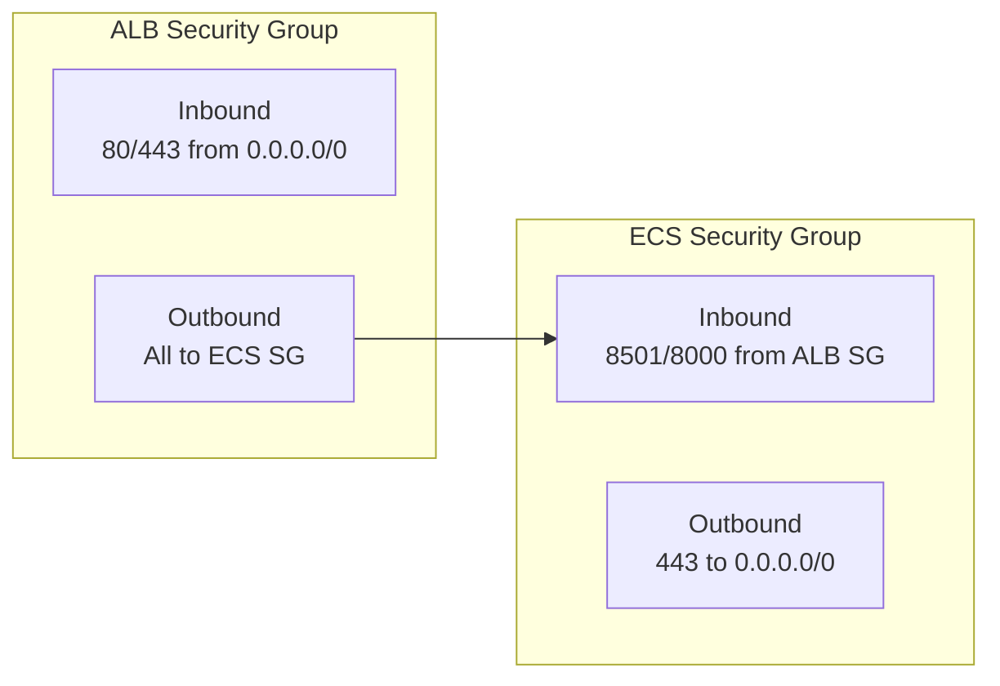
```mermaid
graph LR
    subgraph ALB_SG[ALB Security Group]
        ALB_In[Inbound<br/>80/443 from 0.0.0.0/0]
        ALB_Out[Outbound<br/>All to ECS SG]
    end
    
    subgraph ECS_SG[ECS Security Group]
        ECS_In[Inbound<br/>8501/8000 from ALB SG]
        ECS_Out[Outbound<br/>443 to 0.0.0.0/0]
    end
    
    ALB_Out --> ECS_In
```

**私有子网**:
- ECS任务运行在私有子网
- 通过NAT Gateway访问外网
- 无公网IP暴露

### 9.3 数据安全

**传输加密**:
- HTTPS (ALB终止SSL)
- TLS 1.2+ (API调用)

**存储安全**:
- 日志加密 (CloudWatch)
- 环境变量加密 (Secrets Manager可选)

### 9.4 应用安全

**输入验证**:
- Pydantic模型验证
- 参数类型检查
- SQL注入防护（无直接SQL）

**错误处理**:
- 不暴露内部错误
- 统一错误响应格式
- 日志记录详细信息

## 10. 监控与可观测性

### 10.1 日志架构

**日志层级**:

**ASCII架构图**:
```
Application Logs
├─► INFO: 正常操作
├─► WARNING: 异常但可恢复
├─► ERROR: 错误需要关注
└─► DEBUG: 调试信息
```

**Mermaid架构图**:
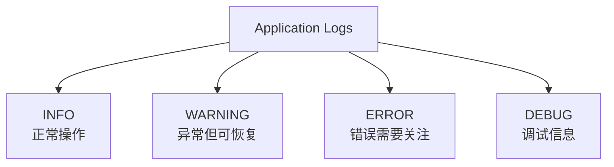
```mermaid
graph TD
    AppLogs[Application Logs] --> INFO[INFO<br/>正常操作]
    AppLogs --> WARNING[WARNING<br/>异常但可恢复]
    AppLogs --> ERROR[ERROR<br/>错误需要关注]
    AppLogs --> DEBUG[DEBUG<br/>调试信息]
```

**日志聚合**:

**ASCII流程图**:
```
Container stdout/stderr
    │
    ▼
CloudWatch Logs
    │
    ├─► /ecs/offshore-wind-backend
    └─► /ecs/offshore-wind-frontend
```

**Mermaid流程图**:
```mermaid
flowchart TD
    Container[Container stdout/stderr] --> CW[CloudWatch Logs]
    CW --> Backend[/ecs/offshore-wind-backend]
    CW --> Frontend[/ecs/offshore-wind-frontend]
```

### 10.2 指标监控

**ECS指标**:
- CPU使用率
- 内存使用率
- 网络流量
- 任务健康状态

**ALB指标**:
- 请求数
- 响应时间
- 错误率
- 目标健康

**Bedrock指标**:
- 调用次数
- Token使用量
- 延迟
- 错误率

### 10.3 告警策略

**关键告警**:
1. ECS任务失败
2. CPU/内存超过80%
3. ALB 5xx错误率 > 5%
4. Bedrock调用失败

### 10.4 追踪

**请求追踪**:
```
用户请求
    │
    ├─► Request ID
    ├─► Timestamp
    ├─► User Input
    ├─► Tool Calls
    ├─► LLM Tokens
    └─► Response Time
```

## 11. 扩展性设计

### 11.1 水平扩展

**ECS服务扩展**:
```
Auto Scaling Policy
├─► Target: CPU 70%
├─► Min: 1 task
├─► Max: 10 tasks
└─► Scale-in: 5分钟
```

### 11.2 功能扩展

**新增MCP服务**:
```python
# 1. 创建MCP Client
new_client = MCPClient(...)

# 2. 启动连接
new_client.__enter__()

# 3. 获取工具
tools = new_client.list_tools_sync()

# 4. 注册到Agent
agent.tools.extend(tools)
```

### 11.3 模型扩展

**支持多模型**:
```python
# Bedrock
model = BedrockModel(model_id="...")

# OpenAI
model = OpenAIModel(model_id="...")

# 自定义
model = CustomModel(...)
```

### 11.4 存储扩展

**未来可添加**:
- DynamoDB: 对话历史持久化
- S3: 文件存储
- RDS: 结构化数据
- ElastiCache: 缓存层

## 12. 总结

### 12.1 架构优势

1. **模块化**: 清晰的分层架构
2. **标准化**: MCP协议统一接入
3. **可扩展**: 易于添加新服务
4. **可维护**: 代码结构清晰
5. **可观测**: 完善的日志监控

### 12.2 技术亮点

1. **Extended Thinking**: 提升推理质量
2. **MCP协议**: 标准化工具集成
3. **流式输出**: 实时用户反馈
4. **Pydantic验证**: 类型安全
5. **Fargate部署**: 无服务器容器

### 12.3 改进方向

1. **缓存机制**: 减少重复API调用
2. **异步处理**: 提升并发性能
3. **数据持久化**: 保存对话历史
4. **多租户**: 支持多用户隔离
5. **A/B测试**: 模型效果对比
